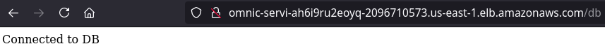
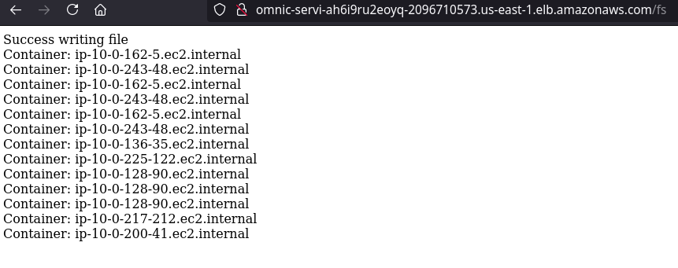
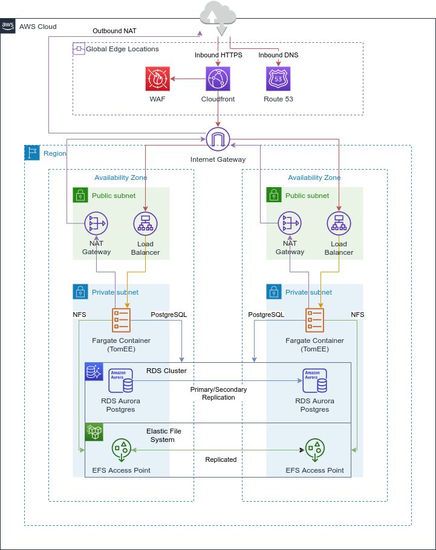
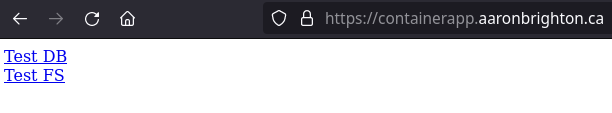

# cdk-tomee-fargate-rds-efs

This CDK app and TomEE sample app when deployed results in a regionally (intra) redundant set of AWS Fargate tasks (containers) backed by both a redundant RDS Aurora Postgres cluster and a redundant EFS (NFS) file system.  Additionally a custom domain can be used with a Cloudfront distribution sitting as the entry point to the application protected by a AWS WAF (Web Application Firewall).


## Screenshots





## Diagram




## Requirements

- [node](https://nodejs.org/en/download/)
- [yarn](https://classic.yarnpkg.com/en/docs/install/#debian-stable)
- [cdk](https://cdkworkshop.com/15-prerequisites.html)
- [projen](https://www.npmjs.com/package/projen)
- [docker](https://docs.docker.com/get-docker/)
- [maven](https://maven.apache.org/users/index.html)

### Install dependencies

This will download node dependencies needed by the CDK app.

```
yarn install
```

### Configure custom domain

In the `cdk.context.json` file add/update the following properties to match a Route 53 hosted zone in your AWS account:

```
{
  "customDomain": "containerapp.aaronbrighton.ca",
  "customDomainZoneName": "aaronbrighton.ca",
  "customDomainZoneId": "ZRZJWLXW3FS0K"
}
```

**Optionally**, you can also configure the WAF to operate with an IP whitelist (only allowing specified IPs), add the `ipAllowList` property to the `cdk.context.json`:

```
{
  "customDomain": "containerapp.aaronbrighton.ca",
  "customDomainZoneName": "aaronbrighton.ca",
  "customDomainZoneId": "ZRZJWLXW3FS0K",
  "ipAllowList": [
      "206.214.231.164/32"
  ]
}
```

### Build TomEE sample app

This will build the TomEE sample app and place deployment artifacts for the Docker containers (to be run on Fargate) in the `src/docker/fargate.rds.efs.test/target/fargate.rds.efs.test` directory.

```
cd src/docker/fargate.rds.efs.test
mvn clean package -Pwildfly
```

### Deploy

This invokes CDK deploy which will:

1. Build the docker container and push to ECR
2. Deploy the application using CloudFormation

```
yarn deploy
```

This may take a while, when it's complete you'll see the following outputs.  The `cdk-tomee-fargate-rds-efs.CdnEndpoint` is the HTTPS endpoint to access your TomEE sample application:

```
Outputs:
cdk-tomee-fargate-rds-efs.CdnEndpoint = https://containerapp.aaronbrighton.ca/
cdk-tomee-fargate-rds-efs.ServiceLoadBalancerDNSEC5B149E = conta-Servi-1J0WMTQLRQK10-2043416999.us-east-1.elb.amazonaws.com
cdk-tomee-fargate-rds-efs.ServiceServiceURL250C0FB6 = https://lbcontainerapp.abrighton.dev.moderncampus.net
```

You can click on the links on the landing page to test the database connectivity and EFS functionality:



## Rough Cost Estimate

**Note:** This doesn't include everything, but attempts to capture the per-hour idle costs in the `us-east-1` region.

| **Resource**  | **Per Hour Cost ($)** | **Quantity** | **Per Hour Total Cost ($)** |
| ------------- | --------------------- | ------------ | --------------------------- |
| NAT Gateway   | $0.045                | 2            | $0.090                      |
| ALB           | $0.023                | 1            | $0.023                      |
| RDS (db.t3)   | $0.082                | 2            | $0.164                      |
| Fargate (2C8G) | $0.045               | 2            | $0.090                      |
| _Hours/Day_   |                       | 24           | **$8.81**                   |
| _Hours/Month_ |                       | 750          | **$275.25**                 |
